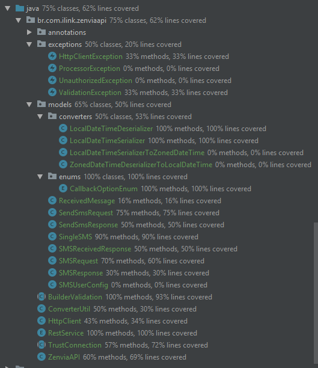
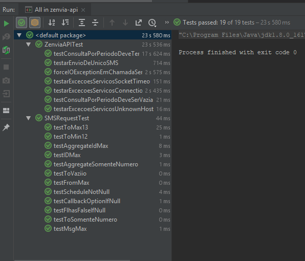

# ZenviaAPI

#### Descrição
> API para chamadas a serviços de envio de SMS da empresa [ZenviaAPI](https://zenviasms.docs.apiary.io/) SMS.

## Unidades de Test
Cobertura de código:
 

 
Tests implementados
 

## Como usar
Configurações
    
    //Dentro do arquivos de profile tem as configurações de URL, usuário e senha, mas é possível
    //informar usuário e senha em Runtime.
      src/main/filters/dev.properties
      src/main/filters/prod.properties

  Criando resquisição
    
    //Sem DDD
    ZenviaAPI.SMSRequest requisicao = ZenviaAPI.SMSRequest.builder()
        .para("6296521489")
        .para("6296521482")
        .para("6296521483")
        .mensagem("Mensagem")
        .codigoInterno("3245234")    //Id interno da Callink
        .build();
        
  Enviado SMS
  
    List<ZenviaAPI.SMSResponse> resps =
          ZenviaAPI.preparar(requisicao).enviar();
    //Retorna uma lista dos SMSs enviados para cada numero adicionado

  Verificando status de Envio. *(Somente por período)*
      
    List<ZenviaAPI.ReceivedMessage> resp = ZenviaAPI
            .preparar(LocalDateTime.now().minusMinutes(5), LocalDateTime.now())
            .check();      
    
  Espeficicando usuário e senha
  
    ZenviaAPI.config(
              ZenviaAPI.SMSUserConfig.build("USUARIO", "SENHA")
            )
            .prepare(req)
            .envia();
    
#### Dúvidas 
[by Wellton S. Barros - makotostudiodev@gmail.com](https://github.com/Cafecanudo/zenvia-api)